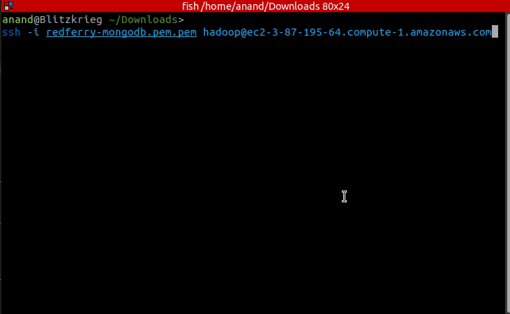
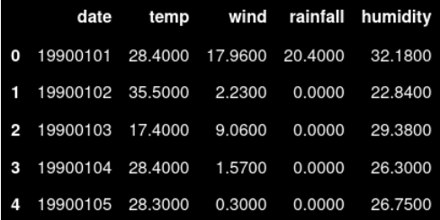
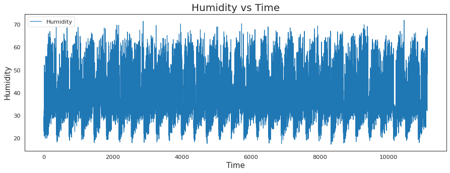
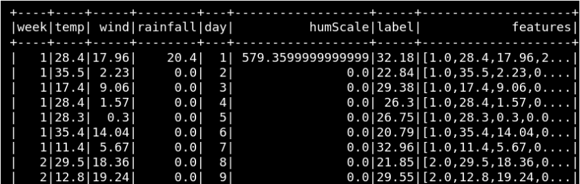
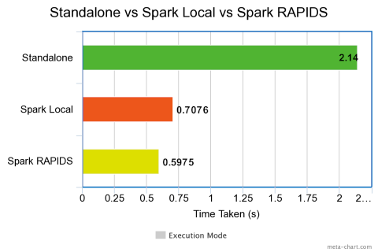
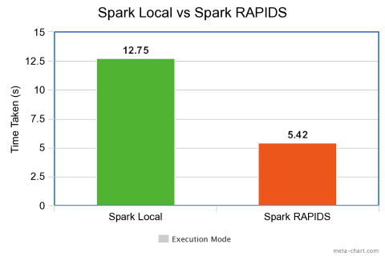

# Scalable Machine Learning with Spark
_Scalable ML using Spark MLlib on Standalone Cluster, AWS EMR with Docker &amp; Nvidia RAPIDS Accelerator_


To get step-by-step instructions to run this project, **visit my blog here**<br>
https://towardsdatascience.com/indian-accent-speech-recognition-2d433eb7edac


# Important Files

These are the 4 significant code bases:<br>

**1) Standalone:** StandAlone Multi-Variate Time Series Prediction.ipynb<br>
**2) Spark Local:** Distributed Multi-Variate Time Series Prediction.ipynb<br>
**3) Spark Cluster:** Distributed Time Series Prediction on AWS EMR Spark Cluster.ipynb<br>
**4) Spark RAPIDS:** String Count Reduce in Spark Rapids.ipynb<br><br>


# How to Use?

You can either run the code in your local after doing the Spark Local setup as below. If you want to run it on a multi-node cluster then you can use AWS EMR and Spark Rapids as explained in the blog above. 

## Spark: Local System Setup

```
docker pull jupyter/pyspark-notebook
docker run -it -p 8888:8888 jupyter/pyspark-notebook
```

- Either click the link with Auth-Token or go-to http://localhost:8888/ and copy paste the token
- Now you can execute Spark code in Jupyter or Terminal. 
- If you want to execute in docker, just run spark-submit pi-code.py
<br>

## Spark: Cluster Setup on Cloud

You can set up a cluster using AWS EMR. The steps are **detailed in "Section C. Spark Cluster: AWS Elastic Map Reduce + Docker".**

The steps are captured in the below animation as well.<br>


During cluster creation, enter below configuration under 'Software Settings'<br>

```
[
  {
    "Classification": "container-executor",
    "Configurations": [
        {
            "Classification": "docker",
            "Properties": {
                "docker.trusted.registries": "local,centos,123456789123.dkr.ecr.us-east-1.amazonaws.com",
                "docker.privileged-containers.registries": "local,centos,123456789123.dkr.ecr.us-east-1.amazonaws.com"
            }
        },
    ]
  },
  {
      "Classification":"livy-conf",
      "Properties":{
         "livy.impersonation.enabled": "true",
         "livy.spark.master":"yarn",
         "livy.spark.deploy-mode":"cluster",
         "livy.server.session.timeout":"16h"
      }
   },
   {
    "Classification": "core-site",
    "Properties": {
      "hadoop.proxyuser.livy.groups": "*",
      "hadoop.proxyuser.livy.hosts": "*"
    }
   },
   {
      "Classification":"hive-site",
      "Properties":{
         "hive.execution.mode":"container"
      }
   },
   {
      "Classification":"spark-defaults",
      "Properties":{
         "spark.executorEnv.YARN_CONTAINER_RUNTIME_TYPE":"docker",
         "spark.yarn.am.waitTime":"300s",
         "spark.yarn.appMasterEnv.YARN_CONTAINER_RUNTIME_TYPE":"docker",
         "spark.executorEnv.YARN_CONTAINER_RUNTIME_DOCKER_CLIENT_CONFIG":"hdfs:///user/hadoop/config.json",
         "spark.executorEnv.YARN_CONTAINER_RUNTIME_DOCKER_IMAGE":"123456789123.dkr.ecr.us-east-1.amazonaws.com/scalableml:s3spark",
"spark.executor.instances":"2",
         "spark.yarn.appMasterEnv.YARN_CONTAINER_RUNTIME_DOCKER_CLIENT_CONFIG":"hdfs:///user/hadoop/config.json",
         "spark.yarn.appMasterEnv.YARN_CONTAINER_RUNTIME_DOCKER_IMAGE":"123456789123.dkr.ecr.us-east-1.amazonaws.com/scalableml:s3spark"
      }
   }
]
```

**To enable YARN to access images from ECR**, we need to generate config.json and put in HDFS so that it can be used by jobs running on the cluster.<br>

```
ssh -i permission.pem hadoop@ec2-1-23-45-678.compute-1.amazonaws.com
aws ecr get-login-password --region us-east-1 | sudo docker login --username AWS --password-stdin 123456789123.dkr.ecr.us-east-1.amazonaws.com
mkdir -p ~/.docker
sudo cp /root/.docker/config.json ~/.docker/config.json
sudo chmod 644 ~/.docker/config.json
hadoop fs -put ~/.docker/config.json /user/hadoop/
```
<br>



- You can **resolve the project dependancies by mounting a docker**, built with the packages as needed by the project. 

- Please remember to give the corresponding docker image as configuration under 'Software Settings', during cluster creation and EMR Notebook initialization:  'docker.io/06021981/scalableml:s3spark' 

- You can also get the docker image for this project using the command below, and upload to your AWS ECR. But dont forget to change the DOCKER_IMAGE config accordingly.

```
docker pull 06021981/scalableml:s3spark
```

- Then, upload the given notebooks to EMR Notebooks and attach to the spunned up cluster.
- In Jupyter notebook, give below config as the first cell. Please modify the DOCKER IMAGE link from ECR to docker.io<br>

```
%%configure -f
{"conf": 
 { 
     "spark.pyspark.virtualenv.enabled": "false",
     "spark.yarn.appMasterEnv.YARN_CONTAINER_RUNTIME_TYPE":"docker",
     "spark.executorEnv.YARN_CONTAINER_RUNTIME_DOCKER_CLIENT_CONFIG":"hdfs:///user/hadoop/config.json",
     "spark.executorEnv.YARN_CONTAINER_RUNTIME_DOCKER_IMAGE":"123456789123.dkr.ecr.us-east-1.amazonaws.com/scalableml:s3spark",
     "spark.executor.instances":"2",
     "spark.yarn.appMasterEnv.YARN_CONTAINER_RUNTIME_DOCKER_CLIENT_CONFIG":"hdfs:///user/hadoop/config.json",
     "spark.yarn.appMasterEnv.YARN_CONTAINER_RUNTIME_DOCKER_IMAGE":"123456789123.dkr.ecr.us-east-1.amazonaws.com/scalableml:s3spark"
 }
}
```

## To create custom Docker Image to resolve cluster dependancies

- Create a directory and a requirements.txt file. **The requirements.txt file should contain all the dependencies required by your Spark application.**<br>

```
mkdir pyspark
vi pyspark/requirements.txt
vi pyspark/Dockerfile
Sample requirements.txt:

python-dateutil==2.8.1
scikit-image==0.18.1
statsmodels==0.12.2
scikit-learn==0.23.2
```

- Create a Dockerfile inside the directory with following contents. A specific numpy version is installed to confirm docker execution from EMR Notebook.<br>

```
FROM amazoncorretto:8
RUN yum -y update
RUN yum -y install yum-utils
RUN yum -y groupinstall development
RUN yum list python3*
RUN yum -y install python3 python3-dev python3-pip python3-virtualenv python-dev
RUN python -V
RUN python3 -V
ENV PYSPARK_DRIVER_PYTHON python3
ENV PYSPARK_PYTHON python3
RUN pip3 install --upgrade pip
RUN pip3 install 'numpy==1.17.5'
RUN python3 -c "import numpy as np"
WORKDIR /app
COPY requirements.txt requirements.txt
RUN pip3 install -r requirements.txt
```

- **Build the docker image using the command below.** Tag and upload the locally built image to ECR.<br>

```
sudo docker build -t local/pyspark-example pyspark/
aws ecr create-repository --repository-name emr-docker-examples
sudo docker tag local/pyspark-example 123456789123.dkr.ecr.us-east-1.amazonaws.com/emr-docker-examples:pyspark-example
sudo aws ecr get-login --region us-east-1 --no-include-email | sudo docker login -u AWS -p <password> https://123456789123.dkr.ecr.us-east-1.amazonaws.com
sudo docker push 123456789123.dkr.ecr.us-east-1.amazonaws.com/emr-docker-examples:pyspark-example
```

<br>You can also **upload to Docker Hub** and give 'docker.io/account/docker-name:tag' instead of AWS ECR Image URI above.<br>


# Time Series Prediction using Random Forest  

This project aims to solve an ML problem in Standalone, Spark Local & Spark Cluster mode. <br>

**Problem Statement:** The daily temperate, wind, rainfall and humidity of a location is noted from 1990~2020s. Given these features, build a time series model to predict the humidity in Y2021. To verify the model, use 2020Q4 humidity values to compare, using a metric.<br>


Here is a glimpse of the input data:<br>


**Time series nature** of the humidity values is clearly visible:<br>


The **data transformed** for Spark processing is as below:<br>


The predicted and actual humidity values on **Standalone implementation** is as shown below:<br>


The predicted and actual humidity values on **Distributed implementation** is as shown below:<br>


The **timing comparison between Standalone, Distributed & Spark Rapids** implementation of the above project is as depicted below:<br>



Furthermore, we aim to generate **100M tuples of random string and count**, to feed in to distributed count operation. The timing comparison of such distributed count operations between Spark Local and Spark RAPIDS is depicted below:<br>



For more details of the project, read here:<br>
https://towardsdatascience.com/indian-accent-speech-recognition-2d433eb7edac


If you have any query or suggestion, you can **reach me here.** https://www.linkedin.com/in/ananduthaman/<br><br>

# References
[1] www.appliedaicourse.com <br>
[2] Dean, Jeffrey, and Sanjay Ghemawat. "MapReduce: simplified data processing on large clusters." Communications of the ACM51.1 (2008)<br>
[3] PySpark Documentation: https://spark.apache.org/docs/latest/api/python/index.html<br>
[4] Spark MLLib: https://spark.apache.org/docs/1.2.1/mllib-guide.html<br>
[5] Spark SQL: https://spark.apache.org/docs/2.2.0/sql-programming-guide.html#sql<br>
[6] AWS EMR: https://docs.aws.amazon.com/emr/latest/ReleaseGuide/emr-spark-docker.html<br>
[7] AWS EMR with Docker: https://aws.amazon.com/blogs/big-data/<br>simplify-your-spark-dependency-management-with-docker-in-emr-6-0-0/<br>
[8] GPU Cluster (Spark-Rapids): https://docs.aws.amazon.com/emr/latest/ReleaseGuide/emr-spark-rapids.html<br>
